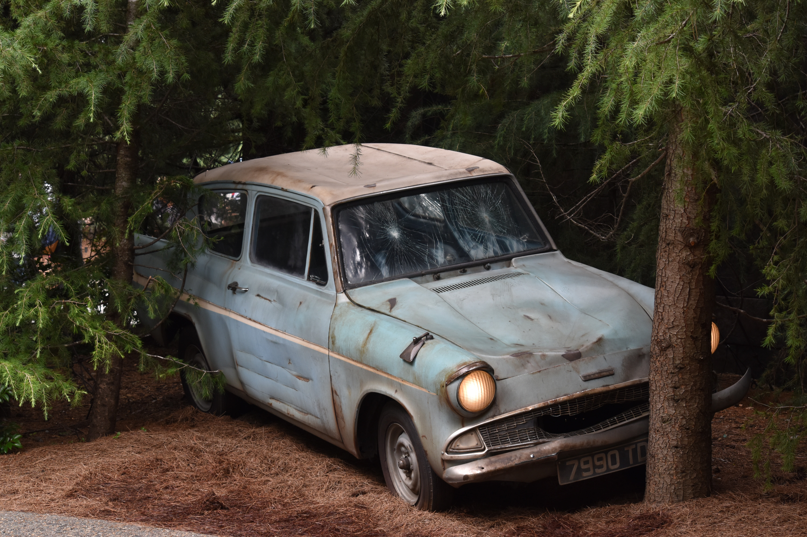

## WEB SLIDES
In this project we'll going to build a slideshow type webpages using HTML and CSS and JavaScript a Libray called *web slides*.

## DIRECTORY STRUCTURE 
Now we'll need to create the directory structure for our project. Additionally we'll need to add the *web slides* css file javaScript file to css folder and js folder.
```bash
mkdir webSlides
cd webSlides
touch index.html
mkdir css js 
mkdir img
```
First we create a directory called webSlides and move in to that directory. Next we create a the index.html file. Finally we create a two directories called css and js. We'll be using those two directries to store the webSlides css file and javaScript file.
Next we need to download the zipfile of the webSlide. [webSlide](https://github.com/webslides/webslides/).
After that we need to extract the zip file. There is a folder called static. Inside the static folder go to the css folder and copy the css file and paste in our application's css file. Same for the javaScript file. move to the javaScript folder and copy the javaScript file and paste in our javaScript folder.
And If you want download some images from unsplash.com and add that to the img folder unless use the same images I used to create the webSlides.

## INITIAL HTML
Let's start with writing the initial html for our application inside the `index.html` page.
```html
<!DOCTYPE html>
<html lang="en">
    <head>
        <meta charset="UTF-8">
        <meta name="viewport" content="width=device-width initial-scale=1.0" />
        <title>Web slides</title>
        <link rel="preconnect" href="https://fonts.googleapis.com">
        <link rel="preconnect" href="https://fonts.gstatic.com" crossorigin>
        <link href="https://fonts.googleapis.com/css2?family=Roboto:wght@100&display=swap" rel="stylesheet">
        <link rel="stylesheet" href="https://cdnjs.cloudflare.com/ajax/libs/font-awesome/6.0.0-beta3/css/all.min.css"
        integrity="sha512-Fo3rlrZj/k7ujTnHg4CGR2D7kSs0v4LLanw2qksYuRlEzO+tcaEPQogQ0KaoGN26/zrn20ImR1DfuLWnOo7aBA=="
        crossorigin="anonymous" referrerpolicy="no-referrer" />
        <link rel="stylesheet" href="css/webslides.css" />
        <link rel="stylesheet" href="css/style.css" />
    </head>
    <body>


        <script src="js/webslides.js"></script>
        <script>
            window.ws = new WebSlides();
        </script>
    </body>
</html>
```
Add the doctype declartion. Inside the head tag add two meta tags, title and link to the *webslides.css* file. Inside the body give a link to the *webslides.js* file.
We also get a font(Roboto) from the google fonts and icons from the fontawesome. We added those links inside the head tag.
To add our own style (override the current styles) we also add a stylesheet.
We also initialised the webSlide object in a new script tag. Before that we create a script tag that give link to the webslides.js file.

## APPLICATION STRUCTURE
We'll need to make the structure of our slides. Here is how we can do that.
```html
<main role="main">
    <article id="webslides" class="horizontal">
        <section>
            Slide 1
        </section>
        <section>
            Slide 2
        </section>
    </article>
</main>
```
Inside the body first we need to define a main tag with a role called main. Next we add a div tag with id called webSlides and class called horizontal. Inside that div we can define the sections as slides.

## ADDING A BACKGROUND IMAGE
Now let's go ahead and add a backgroun image to the first slide.
```HTML
<section>
    <span class="background" style="background-image:url('img/background.jpg')"></span>
</section>
```
We first define a span tag. Next we add class called background. Finally we specify a style tag and give the url for the background image.

## ADDING CONTENT TO THE SLIDES
Let's go ahead and add some content to our slides.
```HTML
<div class="wrap">
    <h1><strong>Book shop</strong></h1>
    <p class="text-intro">
        Download any ebooks you like <br>
        free from our website.
    </p>
    <p>
        <a href="#" class="button zoomIn">
            Download
        </a>
    </p>
</div>
```
we define some content using basic html tags like h1 and p. But we add different classes to style differentely. 

## SECOND SLIDE
Adding a list for the second slide is the next thing we'll going to do.

```HTML
	<span class="background" style="background: url('img/background.jpg')"></span>
	<div class="wrap size-50 aligncenter">
	<h2><strong>Harry Potter Books</strong></h2>
	<p class="text-intro">Get the Harry Potter Books</p>
	<div class="bg-white shadow">
	<ul class="flexblock reasons">
		<li>
			<h1>Harry Potter and philoshopher's stone</h1>
		<li>
		<li>
			<h1>Harry Potter and chamber of secrets</h1>
			
		<li>
		<li>
			<h1>Harry Potter and Prisinor of Azkaban</h1>
		<li>
	</ul>
</div>
</div>
```
First we add the content that we want to say to the user. Harry potter books, Get the harry potter books and list out the harry potter books. Next we use `li` elements to make them as list. And we group them using `ul` element and add the two classes called `flexblock and reasons`.
Next we add a white background and shadow to that ul list. We specify two classes called `bg-white, shodow` for that.
Next we use p tag to wrap the content about the books. and we add a class called `text-intro` to that p tag. We also markup the intro text using `strong` tag and markup that using h2 tag.
Next we align the entire list in center and give a size. we done that by creating a div and adding a classes called `wrap size-50 and aligncenter`.
Finally we add a background image. We done that by creating a span element. we specify that class to `background` and we specify the background image location inside the style attribute.

## THIRD SLIDE
In this slide we'll going to use the grid system. we want some content and image side by side in one column.
```HTML
<section>
    <div class="wrap">
        <div class="grid vertical-align">
        <div class="column">
        <h3><strong>Harry Potter and Philiosophere's stone</strong></h3>
        <p class="text-intro">This is Harry Potter book one.</p>
        <p>Harry Potter and the Philosopher's Stone is a fantasy novel written by British author J. K. Rowling. The first novel in the Harry Potter series and Rowling's debut novel, it follows Harry Potter, a young wizard who discovers his magical heritage on his eleventh birthday, when he receives a letter of acceptance to Hogwarts School of Witchcraft and Wizardry. Harry makes close friends and a few enemies during his first year at the school, and with the help of his friends, he faces an attempted comeback by the dark wizard Lord Voldemort, who killed Harry's parents, but failed to kill Harry when he was just 15 months old.</p>
        </div>
        <div class="column">
            
        </div>
        </div>
    </div>
</section>

```
First we add the most important part of our slide *the content*. we add a header and some intro text and paragraph about the book. Next we mark up them using html. we use h3 for the header and p for other content. And also we use sementic markup like `strong` to the header.
Next we add a class that has a value called `text-intro`. for the intro text.
Next we layout things by using grid-system. First we warp the content using a div and add a class called column. Next we add a another column that that have a image.
Next we wrap those columns using a div that have a two class called `grid, vertical-align`. Finally we wrap that using a div that have a class called `wrap`.

## FOURTH SLIDE
In this slide we'll going to make a list in horizontal direction.

```HTML
			<section>
				<span class="background" style="background: url('img/background.jpg')"></span>
				<div class="wrap">
				<ul class="flexblock features">
					<li>
						<div>
							<h2>Harry Potter and Philiosopher's stone</h2>
							
						</div>
					</li>
					<li>
						<div>
							<h2>Harry Potter and Chamber of secrets</h2>
						
						</div>
					</li>
					<li>
						<div>
							<h2>Harry Potter and Prisonar of Azkaban</h2>
							
						</div>
					</li>
				</ul>
			</div>
			</section>
```
First we add a background image. we done the same as the slide two. But in this case we define the ul class as `flexblock features'.

## FLEXBLOCK GALLERY
This slide we'll want to create a image gallery.
```HTML
<section>
    <div class="wrap">
        <ul class="flexblock gallery">
            <li>
                <figure>
                    
                    <figcaption>
                        <h2>Flying Ford Anglia</h2>
                    </figcaption>
                </figure>
            </li>
            <li>
                <figure>
                    
                    <figcaption>
                        <h2>Spell Book</h2>
                    </figcaption>
                </figure>
            </li>
            <li>
                <figure>
                    
                    <figcaption>
                        <h2>Hogwarts express</h2>
                    </figcaption>
                </figure>
            </li>
        </ul>
    </div>
</section>
```
We start by creating the content first. In this case the image and the image text is what matter to us. Then we mark up them using basic html. we use `figure, figcaption, h2, li, ul, div, section` tags. Then we apply the `webslides` class for some tags. we add the `flexblock gallery` for the `ul` tag and `wrap` class for the div tag.

## TABLE
Now let's make a table using webSlides.
```HTML
           <section>
                <div class="wrap">
                    <div class="grid vertical-align">
                        <div class="column">
                            <h4>Top Characters</h4>
                                <ul class="description">
                                    <li><a>Harry Potter</a></li>
                                    <li><a>Hermione Granger</a></li>
                                    <li><a>Ron Weisely</a></li>
                                </ul>
                        </div>
                        <div class="column">
                            <h4>Second Characters</h4>
                                <ul class="description">
                                    <li><a>Lord Voldemort</a></li>
                                    <li><a>Albus Dumbeldore</a></li>
                                    <li><a>Severus Snape</a></li>
                                </ul>
                        </div>
                        <div class="column">
                            <h4>Third Characters</h4>
                                <ul class="description">
                                    <li><a>Sirius Black</a></li>
                                    <li><a>Draco Malfoy</a></li>
                                    <li><a>Nevil Longbottom</a></li>
                                </ul>
                        </div>
                    </div>
                </div>
            </section>
```
We use grid system. first we specify a div with a class called `grid` we make this grid vertial by adding a class called `vertical-grid`. Next we specify a another div that have a class called `column`. Next we add some content. And copy paste three times.

## DOWNLOAD SLIDE
Let's add another slide before finishing with thank you slide. 
```HTML
<section class="aligncenter">
    <div class="wrap">
        <h2><strong>Are You Ready?</strong></h2>
        <p class="text-intro">
            Are you ready to become a fullstack web developer?
        </p>
        <p>
            <a href="#" class="button">
                Download Our Brochure
            </a>
        </p>
    </div>
</section>
```
First we add the content we want to show to the user. They are just some paragraph of text and a download text. next we add basic html markup for the content. Main text inside a h2 , paragraph inside a p tag and download text inside a anchor tag. Next we add the webSlides markup. First we make the anchor tag to a button by adding a class called `button`. and we wrap all the tags inside a div that have a class called `wrap`. To make this a slide we wrap that div inside a section tag. To make the section to align center we add a class to the section tag called `aligncenter`.

## THANK YOU SLIDE
Now we'll need to finish our slide presentation with thank you note.
```HTML
<section>
<div class="wrap">
    <div class="content-right text-serif">
        <h2><strong>Thank You!</strong></h2>
        <p>Thank you to the creators of WebSlides :) Follow them on Twitter below<p>
        <p>
            <a href="https://twitter.com/jlantunez">@jlantunez</a>,
			<a href="https://twitter.com/belelros">@belelros</a>, and
			<a href="https://twitter.com/luissacristan">@luissacristan</a>.
        </p>
    </div>
</div>
</section>
```
First we start with creating a new section that representing the one individual slide. Next we add a div with a class called wrap. we put all the content inside this div. First we add some content like thank you note and the people that we want to thank you. And add the basic html markup like `h2 p a strong`.
Finally we make the slide content to the bottom by adding a class called `slide-bottom` to the section. And we make the content right side by adding a class called `content-right`. Finally we turn our font in to serif by adding a class called `text-serif`.
